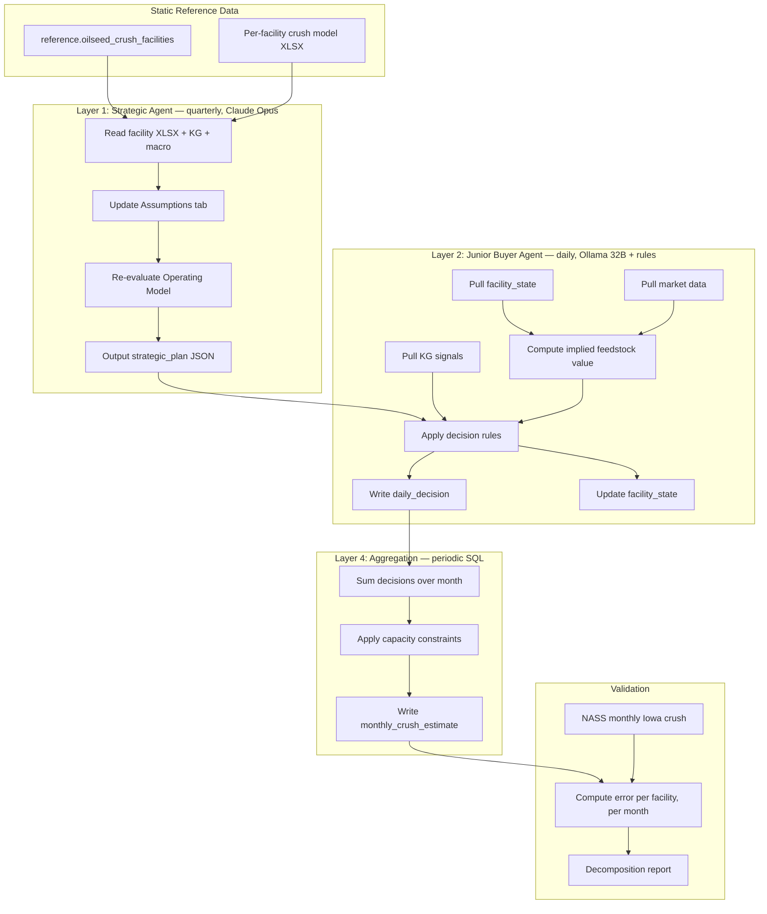

# RLC Iowa Crush Agent System — Build Specification v1.0

**Audience:** Claude Code, building inside the `RLC-Agent` repo
**Owner:** Tore Alden, RLC
**Status:** v1.0 — for execution
**Phase:** Phase Two (Facility Agent Architecture), Iowa-first staging
**Last updated:** April 26, 2026

---

## 1. Purpose

Build the minimum viable system that produces **monthly soybean crush volume estimates for Iowa facilities**, generated by a daily junior-buyer-agent loop, validated against USDA NASS observed monthly crush.

This is the first concrete instantiation of the Phase Two Facility Agent Architecture (see Notion: `Phase Two: Facility Agent Architecture`). Iowa is the staging environment because (a) the universe is small (~15-20 facilities), (b) NASS publishes Iowa-specific monthly crush, and (c) BioTrack rail-car detection has the densest coverage there.

**Out of scope for v1.0:**
- International facilities (Argentina, Brazil)
- Non-soy oilseeds
- Live trading or actual procurement actions
- Layer 3 econometric forecasting (use simple price persistence + KG adjustments)
- LLM-driven decisions for routine days (use deterministic rules; LLM only for edge-case escalation)

---

## 2. Background and References

**Existing infrastructure to use:**
- `reference.oilseed_crush_facilities` (PostgreSQL silver) — 151 facilities including the Iowa subset
- `RLC_Soybean_Crush_Model.xlsx` — per-facility financial model template (just delivered; the calibration anchor)
- Knowledge graph (382 nodes, 260 edges, 211 contexts) — anomaly signals
- 30+ data collectors (USDA, EIA, EPA, CFTC, weather, FGIS export inspection)
- Sensitivity-based model router (Ollama 32B local, Claude cloud)
- Medallion PostgreSQL pipeline (bronze/silver/gold)
- BioTrack AI rail-car detection (validation of throughput)

**Reference documents in Notion:**
- `Phase Two: Facility Agent Architecture` — overall vision and 4-layer design
- `RLC OS` — parent page
- `Standard Operating Procedures (SOPs)` — for agent registry pattern
- `Current Capabilities Inventory` — what's already built

**External validation data:**
- USDA NASS *Oilseed Crushings, Production, Consumption and Stocks* — monthly, state-level, primary validator
- NOPA *Monthly Soybean Crush Report* — national, more timely (mid-month for prior month)
- US Census Bureau M311J — *Fats and Oils: Production, Consumption and Stocks* — lagged but detailed

---

## 3. Success Criteria

The system is successful when, for the Iowa subset:

1. **Coverage:** All Iowa soy crush facilities in `reference.oilseed_crush_facilities` are instantiated in the agent system, each with a valid `facility_state` record updated daily.
2. **Decision flow:** The junior buyer agent produces a daily decision per facility for any given trading day, written to `bronze.daily_decisions`.
3. **Aggregation:** Monthly Iowa crush volume estimates are produced for each calendar month and stored in `gold.monthly_crush_estimates`.
4. **Backtest accuracy:** On a 2024-2025 backtest, the modeled monthly Iowa total is within **±5% of NASS monthly Iowa soybean crush** averaged across 12+ months, with no single month exceeding ±15% error.
5. **Decomposition:** When the model is wrong, the system can identify which facility(ies) contributed most to the error, and a human reviewer can explain why.
6. **Reproducibility:** Re-running the system on the same historical inputs produces the same outputs (deterministic where possible; LLM calls cached or seeded).

---

## 4. Architecture Overview



**Cadence:**
- Layer 1 (Strategic): runs quarterly per facility, on demand for major regime shifts
- Layer 2 (Buyer): runs daily per facility, every trading day at 06:00 CT (configurable)
- Layer 4 (Aggregation): runs end-of-day to maintain rolling monthly estimates; finalizes on month close

---

## 5. Iowa Facility Inventory

Pull from `reference.oilseed_crush_facilities` filtered by `state = 'IA' AND primary_oilseed = 'soybean'`. The expected list includes facilities from ADM, AGP (Ag Processing Inc), Cargill, Bunge, Shell Rock Soy Processing, and others, plus any newer entrants. Verify the actual count matches expectations (~15-20 facilities) before proceeding.

For each facility, the following must be populated before agent activation:

| Field | Source | Notes |
|---|---|---|
| `facility_id` | reference table (PK) | Stable identifier |
| `name`, `operator`, `address` | reference table | |
| `lat`, `lon` | reference table | For catchment/basis |
| `nameplate_tpd` | reference table | Tons soybeans per day |
| `operating_days_year` | reference table | Net of maintenance |
| `commissioned_year` | reference table | For depreciation calibration |
| `oil_destination_split` | reference table or catchment model | Default 0.55 BBD if unknown |
| `crush_model_xlsx_path` | object storage | One per facility |

Facilities lacking required fields should be flagged and excluded from agent activation, not silently defaulted.

---

## 6. Data Schemas

All schemas use PostgreSQL DDL syntax. Place each in the appropriate medallion layer.

### 6.1 `silver.facility_static` (existing — augment if needed)

Already exists as `reference.oilseed_crush_facilities`. Confirm these columns exist; add if missing:

```sql
-- Augment if needed
ALTER TABLE reference.oilseed_crush_facilities
  ADD COLUMN IF NOT EXISTS crush_model_xlsx_path TEXT,
  ADD COLUMN IF NOT EXISTS oil_destination_split NUMERIC(4,3) DEFAULT 0.550,
  ADD COLUMN IF NOT EXISTS catchment_basis_ticker TEXT,
  ADD COLUMN IF NOT EXISTS rail_terminal_id TEXT;
```

### 6.2 `silver.facility_state` (NEW — gap #1 from Phase Two doc)

Mutable per-facility state, updated daily by the buyer agent.

```sql
CREATE TABLE IF NOT EXISTS silver.facility_state (
    facility_id              TEXT PRIMARY KEY REFERENCES reference.oilseed_crush_facilities(facility_id),
    as_of_date               DATE NOT NULL,
    
    -- Inventory (all volumes in bushels for soy, lbs for oil, tons for meal)
    bean_inventory_bu        NUMERIC(14,2) NOT NULL DEFAULT 0,
    oil_inventory_lbs        NUMERIC(14,2) NOT NULL DEFAULT 0,
    meal_inventory_tons      NUMERIC(14,2) NOT NULL DEFAULT 0,
    
    -- Forward book
    bean_purchases_committed_bu  NUMERIC(14,2) NOT NULL DEFAULT 0,  -- bought, not yet delivered
    oil_sold_forward_lbs         NUMERIC(14,2) NOT NULL DEFAULT 0,
    meal_sold_forward_tons       NUMERIC(14,2) NOT NULL DEFAULT 0,
    
    -- Operating
    days_of_coverage         NUMERIC(6,2),  -- bean_inventory / planned_daily_crush
    current_crush_rate_tpd   NUMERIC(8,2),  -- actual today, may be < nameplate
    last_30d_crush_bu        NUMERIC(14,2), -- rolling actual
    
    -- Bookkeeping
    last_decision_id         BIGINT,
    updated_at               TIMESTAMPTZ NOT NULL DEFAULT NOW()
);

CREATE INDEX idx_facility_state_as_of ON silver.facility_state(as_of_date);
```

For backtest mode, this table stores the simulated state. Decisions made in the backtest update this table as if real.

### 6.3 `silver.strategic_plan` (NEW — versioned)

Output of Layer 1 strategic agent, per facility per quarter.

```sql
CREATE TABLE IF NOT EXISTS silver.strategic_plan (
    plan_id                  BIGSERIAL PRIMARY KEY,
    facility_id              TEXT NOT NULL REFERENCES reference.oilseed_crush_facilities(facility_id),
    plan_period_start        DATE NOT NULL,  -- e.g., 2026-Q2 = 2026-04-01
    plan_period_end          DATE NOT NULL,
    
    -- Targets
    target_weekly_intake_bu      NUMERIC(14,2),  -- target bushels purchased per week
    target_weekly_crush_bu       NUMERIC(14,2),  -- target bushels crushed per week
    bid_ceiling_basis            NUMERIC(8,4),   -- max basis to pay over CME
    coverage_target_days         INTEGER,        -- target days of forward bean coverage
    coverage_target_min_days     INTEGER,        -- never let coverage drop below this
    coverage_target_max_days     INTEGER,        -- don't accumulate above this
    hedge_ratio_oil              NUMERIC(4,3),   -- 0.0 to 1.0
    hedge_ratio_meal             NUMERIC(4,3),
    
    -- Constraints from spreadsheet
    full_cost_breakeven_bu       NUMERIC(8,4),   -- price/bu where EBIT = 0
    marginal_breakeven_bu        NUMERIC(8,4),   -- price/bu where contribution margin = 0
    
    -- Reasoning
    strategic_memo               TEXT,           -- Claude Opus output
    spreadsheet_snapshot_path    TEXT,           -- versioned XLSX after assumptions update
    
    created_at                   TIMESTAMPTZ NOT NULL DEFAULT NOW(),
    created_by                   TEXT NOT NULL DEFAULT 'strategic_agent_v1'
);

CREATE INDEX idx_strategic_plan_facility_period 
  ON silver.strategic_plan(facility_id, plan_period_start);
```

### 6.4 `bronze.daily_decisions` (NEW — append-only log)

Every decision the buyer agent makes, including no-ops.

```sql
CREATE TABLE IF NOT EXISTS bronze.daily_decisions (
    decision_id              BIGSERIAL PRIMARY KEY,
    facility_id              TEXT NOT NULL,
    decision_date            DATE NOT NULL,
    decision_timestamp       TIMESTAMPTZ NOT NULL DEFAULT NOW(),
    
    -- Market context at decision time
    cme_settle               NUMERIC(8,4),       -- CBOT soybean futures, nearby contract
    local_basis              NUMERIC(8,4),       -- $/bu over CME
    bean_offer_total         NUMERIC(8,4),       -- cme_settle + local_basis
    meal_price               NUMERIC(8,2),       -- $/ton
    oil_cash_price           NUMERIC(8,4),       -- $/lb
    d4_rin_price             NUMERIC(8,4),       -- $/gal
    lcfs_credit_price        NUMERIC(8,2),       -- $/MT CO2e
    ptc_45z                  NUMERIC(8,4),       -- $/gal
    
    -- Computed values
    implied_value_marginal_bu    NUMERIC(8,4),  -- from spreadsheet logic
    implied_value_full_cost_bu   NUMERIC(8,4),
    crush_margin_bu              NUMERIC(8,4),  -- implied_value - bean_offer
    days_of_coverage_at_decision NUMERIC(6,2),
    
    -- Decisions
    buy_bushels              NUMERIC(14,2) NOT NULL DEFAULT 0,
    buy_basis_paid           NUMERIC(8,4),
    buy_delivery_window_start DATE,
    buy_delivery_window_end  DATE,
    
    crush_today_bushels      NUMERIC(14,2) NOT NULL DEFAULT 0,
    crush_rate_tpd_today     NUMERIC(8,2),
    
    forward_sell_oil_lbs     NUMERIC(14,2) NOT NULL DEFAULT 0,
    forward_sell_oil_price   NUMERIC(8,4),
    forward_sell_meal_tons   NUMERIC(14,2) NOT NULL DEFAULT 0,
    forward_sell_meal_price  NUMERIC(8,2),
    
    -- Reasoning
    decision_rule_triggered  TEXT,               -- e.g., 'BUY_FOR_COVERAGE', 'HOLD_BAD_MARGIN'
    kg_signals_active        JSONB,              -- list of anomaly flags considered
    llm_reasoning            TEXT,               -- if LLM was invoked, the reasoning
    used_llm                 BOOLEAN NOT NULL DEFAULT FALSE,
    
    -- For backtest reproducibility
    backtest_run_id          TEXT,               -- NULL if live
    
    CONSTRAINT chk_buy_consistency CHECK (
        (buy_bushels = 0 AND buy_basis_paid IS NULL) 
        OR (buy_bushels > 0 AND buy_basis_paid IS NOT NULL)
    )
);

CREATE INDEX idx_daily_decisions_facility_date ON bronze.daily_decisions(facility_id, decision_date);
CREATE INDEX idx_daily_decisions_backtest ON bronze.daily_decisions(backtest_run_id) 
  WHERE backtest_run_id IS NOT NULL;
```

### 6.5 `gold.monthly_crush_estimates` (NEW — aggregate output)

```sql
CREATE TABLE IF NOT EXISTS gold.monthly_crush_estimates (
    estimate_id              BIGSERIAL PRIMARY KEY,
    facility_id              TEXT NOT NULL,
    year_month               DATE NOT NULL,  -- first of month, e.g., 2026-03-01
    
    -- Estimates
    estimated_crush_bu       NUMERIC(14,2) NOT NULL,
    estimated_oil_lbs        NUMERIC(14,2) NOT NULL,
    estimated_meal_tons      NUMERIC(14,2) NOT NULL,
    estimated_utilization    NUMERIC(4,3),  -- of nameplate
    
    -- Validation (populated when NASS releases for this month)
    nass_state_total_crush_bu  NUMERIC(14,2),  -- Iowa total from NASS
    facility_share_estimated   NUMERIC(5,4),   -- this facility's share of state estimate
    
    -- Status
    is_finalized             BOOLEAN NOT NULL DEFAULT FALSE,  -- true after month close
    backtest_run_id          TEXT,
    
    created_at               TIMESTAMPTZ NOT NULL DEFAULT NOW(),
    
    UNIQUE (facility_id, year_month, backtest_run_id)
);

CREATE INDEX idx_monthly_estimates_year_month ON gold.monthly_crush_estimates(year_month);
```

---

## 7. Core Computation Functions

These live in a new module `src/agents/facility/crush_economics.py`. Pure functions, no I/O. The XLSX is the reference; these distill its logic into callable code.

### 7.1 `implied_feedstock_value_marginal()`

Returns the "board crush + cash basis" implied bean value per bushel, before plant fixed costs. This is what the daily buyer agent keys off.

```python
from dataclasses import dataclass
from decimal import Decimal

@dataclass(frozen=True)
class CrushParams:
    """Per-facility crush yields and conversion factors. From XLSX Assumptions tab."""
    meal_yield_per_ton: float           # tons meal per ton soy, ~0.785
    oil_yield_lbs_per_bu: float         # lbs oil per bushel soy, ~11.5
    other_direct_per_ton: float         # $/ton soy crushed, ~$12
    oil_density_lbs_per_gal: float = 7.7
    lbs_per_bushel: float = 60.0
    lbs_per_ton: float = 2000.0

@dataclass(frozen=True)
class MarketSnapshot:
    """All output prices and credit values at a point in time."""
    meal_price_per_ton: float           # $/ton, e.g., $340
    oil_cash_price_per_lb: float        # $/lb, e.g., $0.49
    d4_rin_per_gal: float               # $/gal
    lcfs_price_per_mt: float            # $/MT CO2e
    lcfs_credits_per_gal: float         # MT/gal, function of CI delta
    ptc_45z_per_gal: float              # $/gal
    credit_haircut: float = 0.85        # realization factor

def implied_feedstock_value_marginal(
    params: CrushParams,
    market: MarketSnapshot,
    oil_bbd_share: float,
) -> float:
    """
    Returns implied bean value per bushel (board crush + cash channel + biofuel channel + credit stack),
    BEFORE plant operating expenses, depreciation, or interest.
    
    This is the maximum a profit-maximizing buyer would pay for one more bushel today,
    holding output prices and channel mix constant.
    
    Negative value = current output prices don't cover even the variable costs of crushing.
    """
    bu_to_ton = params.lbs_per_bushel / params.lbs_per_ton
    
    # Meal contribution per bushel
    meal_lbs_per_bu = params.meal_yield_per_ton * params.lbs_per_bushel
    meal_revenue_per_bu = meal_lbs_per_bu / params.lbs_per_ton * market.meal_price_per_ton
    
    # Oil contribution per bushel
    oil_lbs_total = params.oil_yield_lbs_per_bu
    oil_lbs_cash = oil_lbs_total * (1 - oil_bbd_share)
    oil_lbs_bbd = oil_lbs_total * oil_bbd_share
    oil_gal_bbd = oil_lbs_bbd / params.oil_density_lbs_per_gal
    
    oil_cash_revenue = oil_lbs_cash * market.oil_cash_price_per_lb
    oil_bbd_base_revenue = oil_lbs_bbd * market.oil_cash_price_per_lb
    
    credit_stack_per_gal = (
        market.d4_rin_per_gal
        + market.lcfs_price_per_mt * market.lcfs_credits_per_gal
        + market.ptc_45z_per_gal
    ) * market.credit_haircut
    oil_bbd_credit_revenue = oil_gal_bbd * credit_stack_per_gal
    
    # Other direct costs per bushel
    other_per_bu = params.other_direct_per_ton * bu_to_ton
    
    return (
        meal_revenue_per_bu
        + oil_cash_revenue
        + oil_bbd_base_revenue
        + oil_bbd_credit_revenue
        - other_per_bu
    )
```

### 7.2 `implied_feedstock_value_full_cost()`

Full-cost version. Used by the strategic agent and for break-even analysis.

```python
@dataclass(frozen=True)
class FixedCostsPerBushel:
    """Plant fixed costs allocated per bushel at target throughput. From XLSX."""
    opex_per_bu: float                  # employees, utilities, etc., divided by annual bushels
    depreciation_per_bu: float          # straight-line dep / annual bushels
    maintenance_capex_per_bu: float

def implied_feedstock_value_full_cost(
    params: CrushParams,
    market: MarketSnapshot,
    oil_bbd_share: float,
    fixed_costs: FixedCostsPerBushel,
) -> float:
    """
    Implied feedstock value covering ALL costs (variable + fixed + dep + maintenance capex).
    Negative implication: paying current bean prices, this facility loses money on a fully-loaded basis.
    """
    marginal = implied_feedstock_value_marginal(params, market, oil_bbd_share)
    return marginal - fixed_costs.opex_per_bu - fixed_costs.depreciation_per_bu - fixed_costs.maintenance_capex_per_bu
```

### 7.3 `compute_crush_margin()` and `days_of_coverage()`

```python
def compute_crush_margin_per_bu(
    bean_offer_per_bu: float,
    implied_value_per_bu: float,
) -> float:
    """Positive = profitable to buy and crush. Negative = lose money on this batch."""
    return implied_value_per_bu - bean_offer_per_bu

def days_of_coverage(
    bean_inventory_bu: float,
    bean_purchases_committed_bu: float,
    target_daily_crush_bu: float,
) -> float:
    """How many days the facility can run before running out of beans."""
    if target_daily_crush_bu <= 0:
        return float('inf')
    return (bean_inventory_bu + bean_purchases_committed_bu) / target_daily_crush_bu
```

---

## 8. Strategic Agent (Layer 1)

**Module:** `src/agents/strategic/strategic_agent.py`
**Trigger:** Quarterly cron, plus on-demand for regime shifts (RIN crash, harvest disruption, policy change)
**Model:** Claude Opus via the existing model router

**Inputs:**
- Facility's current crush model XLSX
- Last 6 months of `bronze.daily_decisions` for this facility
- Last 4 quarters of `gold.monthly_crush_estimates` for this facility
- KG context: relevant analyst frameworks, recent anomalies
- Forward curves: CBOT soybeans, soybean meal, soybean oil (from data collectors)
- Policy state: current RFS Set 2 RVOs, 45Z rule status, LCFS amendment status

**Process:**
1. Load XLSX into memory (use `openpyxl` or convert relevant ranges to pandas).
2. Update Assumptions tab with current forward curves (year 1 base prices, escalation rates).
3. Update credit stack inputs (D4 RIN, LCFS, 45Z) from current market.
4. Update `oil_bbd_share` if catchment evidence suggests change.
5. Re-evaluate the workbook (programmatic recalc using LibreOffice headless, or replicated Python logic).
6. Extract: full_cost_breakeven, marginal_breakeven, implied target weekly throughput, EBITDA outlook.
7. LLM call: Claude Opus reads the updated workbook outputs + KG context + last quarter's actual decisions, writes a strategic memo. Memo includes: bid ceiling, coverage targets, hedge ratios, any deviations from default targets and why.
8. Write `silver.strategic_plan` row.
9. Save versioned XLSX snapshot to object storage.

**Output:** One `strategic_plan` row per facility per quarter.

---

## 9. Junior Buyer Agent (Layer 2)

**Module:** `src/agents/facility/buyer_agent.py`
**Trigger:** Daily cron, 06:00 CT, every trading day (skip weekends and CME holidays)
**Model:** Deterministic rules first; Ollama 32B for edge-case escalation

**Decision rules (in priority order):**

```
1. SAFETY: If days_of_coverage < strategic_plan.coverage_target_min_days
   → BUY_FOR_COVERAGE: enough bushels to reach coverage_target_days, at any reasonable basis
   → If best available basis > strategic_plan.bid_ceiling_basis * 1.5 → escalate to LLM
   
2. ECONOMICS: If days_of_coverage >= coverage_target_min_days:
   margin = implied_value_marginal - bean_offer_total
   IF margin > 0 AND days_of_coverage < coverage_target_max_days:
     → BUY_FOR_MARGIN: target weekly intake / 5 (per trading day)
   IF margin <= 0:
     → HOLD_BAD_MARGIN: do not buy today
   
3. UPPER BOUND: If days_of_coverage >= coverage_target_max_days:
   → HOLD_OVERSUPPLIED: do not buy regardless of margin
   
4. CRUSH SCHEDULE: 
   IF margin > 0 AND days_of_coverage > coverage_target_min_days:
     → CRUSH_AT_TARGET: target_weekly_crush_bu / 5 today
   IF margin <= 0 AND inventory perishable risk low:
     → CRUSH_REDUCED: 60% of target rate (slow throughput)
   IF days_of_coverage < coverage_target_min_days * 0.5:
     → CRUSH_REDUCED: stretch existing inventory
   
5. FORWARD SELLING (oil/meal):
   IF current_meal_forward_price * (1 - hedge_ratio_meal) > expected_curve_low:
     → forward_sell_meal_tons = today's planned meal output
   (Same logic for oil)
   
6. ESCALATE TO LLM:
   - Two or more KG anomaly flags active
   - Crush margin within 10% of breakeven AND coverage in middle of range
   - Forward curve inverted by > $0.50/bu
   - Recent NASS data implies own model is off by > 15%
```

**Daily loop pseudocode:**

```python
def buyer_agent_daily(facility_id: str, decision_date: date) -> DailyDecision:
    facility = load_facility_static(facility_id)
    state = load_facility_state(facility_id)
    plan = load_active_strategic_plan(facility_id, decision_date)
    market = pull_market_snapshot(decision_date, facility.catchment_basis_ticker)
    kg_signals = pull_kg_signals(facility_id, decision_date)
    
    params = CrushParams(...)  # from facility XLSX
    
    implied_marginal = implied_feedstock_value_marginal(params, market, facility.oil_destination_split)
    bean_offer = market.cme_settle + market.local_basis
    margin = implied_marginal - bean_offer
    coverage = days_of_coverage(state.bean_inventory_bu, state.bean_purchases_committed_bu, plan.target_daily_crush_bu)
    
    # Apply rules in priority order
    decision = apply_decision_rules(
        margin=margin,
        coverage=coverage,
        bean_offer=bean_offer,
        plan=plan,
        market=market,
        kg_signals=kg_signals,
    )
    
    # Escalate if rule says so
    if decision.escalate_to_llm:
        decision = llm_escalation(facility, state, plan, market, kg_signals, base_decision=decision)
    
    # Persist
    decision_id = write_daily_decision(decision)
    update_facility_state(facility_id, decision)  # apply buy + crush effects
    
    return decision
```

**KG signal injection:**

KG anomalies modify the bid ceiling and target intake. Examples:
- "Iowa harvest 2 weeks late" → reduce target intake by 30%, raise bid ceiling by $0.10/bu
- "Major neighbor plant shut down" → raise target intake by 20% (catchment beans freed up)
- "RIN price collapsed > 20% in 5 days" → freeze BBD-channel assumptions, reduce hedge_ratio_oil by 0.10
- "River freight disrupted" → check if facility is river-dependent; if so, raise local basis assumption by $0.05

These are JSON adjustments applied to plan parameters before rule evaluation.

---

## 10. Aggregation Logic (Layer 4)

**Module:** `src/agents/aggregation/monthly_aggregator.py`
**Trigger:** End-of-day daily (rolling estimate), end-of-month finalization

For each `(facility_id, year_month)`:

```sql
-- Pseudocode SQL for monthly aggregation
INSERT INTO gold.monthly_crush_estimates (facility_id, year_month, estimated_crush_bu, ...)
SELECT
    facility_id,
    DATE_TRUNC('month', decision_date)::DATE AS year_month,
    SUM(crush_today_bushels) AS estimated_crush_bu,
    SUM(crush_today_bushels) * fac.params.oil_yield_lbs_per_bu AS estimated_oil_lbs,
    SUM(crush_today_bushels) * (fac.params.lbs_per_bushel / fac.params.lbs_per_ton) * fac.params.meal_yield_per_ton AS estimated_meal_tons,
    SUM(crush_today_bushels) / (fac.nameplate_tpd * fac.operating_days_year * (lbs_per_ton / lbs_per_bushel) / 12) AS estimated_utilization,
    is_finalized = (year_month < CURRENT_DATE - INTERVAL '1 month'),
    backtest_run_id
FROM bronze.daily_decisions dd
JOIN reference.oilseed_crush_facilities fac USING (facility_id)
WHERE dd.facility_id IN (SELECT facility_id FROM iowa_facilities)
GROUP BY facility_id, year_month, backtest_run_id
ON CONFLICT (facility_id, year_month, backtest_run_id) 
DO UPDATE SET
    estimated_crush_bu = EXCLUDED.estimated_crush_bu,
    -- ... etc
    updated_at = NOW();
```

**Capacity sanity check:** If aggregated crush > nameplate × operating days for the month, flag and clip. The buyer agent shouldn't produce this, but verify.

**Carryover handling:** Beans purchased in month *m* but delivered in month *m+1* are accounted for at delivery date for inventory purposes. Crushed bushels are counted at the date of the crush decision.

---

## 11. Validation Harness

**Module:** `src/validation/iowa_backtest.py`

### 11.1 Backtest procedure

1. **Initialize** facility states for all Iowa facilities as of `backtest_start_date` (suggested: 2024-09-01, beginning of 2024/25 marketing year).
   - Use historical NASS Iowa monthly crush divided by 30 to seed `last_30d_crush_bu`.
   - Use industry survey or proportional allocation for `bean_inventory_bu` (fall stocks tend to be high; spring/summer low).
2. **Run strategic agent** for 2024-Q3 to seed initial plans.
3. **Loop** over trading days from `backtest_start_date` to `backtest_end_date`:
   a. For each Iowa facility, pull historical market data for that day.
   b. Run buyer agent with historical inputs (no live market calls).
   c. Update facility state.
   d. Trigger strategic re-plan at quarter boundaries.
4. **Aggregate** monthly per facility and Iowa-wide.
5. **Compare** to NASS monthly Iowa soybean crush.

All decisions tagged with `backtest_run_id` so multiple backtest runs can coexist.

### 11.2 Validation metrics

```python
def validate_against_nass(backtest_run_id: str, year_months: list[date]) -> ValidationReport:
    """
    Compare modeled monthly Iowa crush vs NASS observed.
    
    Returns:
        ValidationReport with:
        - per_month_error_pct: dict[year_month, float]
        - per_facility_avg_error_pct: dict[facility_id, float]
        - aggregate_mae_pct: float  (mean absolute % error, Iowa total)
        - aggregate_rmse_pct: float
        - worst_month: tuple[year_month, error_pct]
        - decomposition: which facilities contributed most to total error
    """
```

**Pass criteria for v1.0:**
- `aggregate_mae_pct ≤ 5%` over the backtest window
- No single month with `abs(error_pct) > 15%`
- For any month exceeding 10% error, the decomposition can identify ≥1 facility-level driver

### 11.3 Data sources for backtest market data

Already in your data collectors:
- CBOT soybean futures: continuous front-month from CME data feed
- Local Iowa basis: from `silver.bean_basis` (if exists; build from `bronze.basis_quotes` if not)
- Soybean oil cash: from `silver.oil_prices`
- Soybean meal: from `silver.meal_prices`
- D4 RINs: from EPA EMTS collector
- LCFS: from CARB credit price collector
- 45Z PTC value: from your CI/policy collector or rule-based default

### 11.4 NASS data ingestion (if not already a collector)

Build `nass_oilseed_crushings_collector.py` if not already present:
- Source: https://quickstats.nass.usda.gov (API key required, free)
- Query: `commodity_desc='SOYBEANS', statisticcat_desc='CRUSHED', state='IOWA', freq_desc='MONTHLY'`
- Land in `bronze.nass_oilseed_crushings`, transform to `silver.state_monthly_crush`
- Schema: `state, year_month, soybean_crushed_bu, soybean_oil_produced_lbs, soybean_meal_produced_tons, source, retrieved_at`

---

## 12. Implementation Order

Build in this order. Each step has a clear test of completion.

| # | Task | Test of completion |
|---|---|---|
| 1 | Create new tables: `silver.facility_state`, `silver.strategic_plan`, `bronze.daily_decisions`, `gold.monthly_crush_estimates` | `\d+ silver.facility_state` shows expected schema |
| 2 | Augment `reference.oilseed_crush_facilities` with new columns; populate for Iowa facilities | All Iowa facilities have non-null required fields |
| 3 | Build NASS collector if missing; backfill 2024-2026 Iowa state crush data | `SELECT COUNT(*) FROM silver.state_monthly_crush WHERE state='IA'` returns >= 18 rows |
| 4 | Implement `crush_economics.py` with the four functions in §7. Unit-test against the XLSX-derived values for one facility (compute by hand from a snapshot, verify match within $0.01/bu). | `pytest src/agents/facility/test_crush_economics.py` passes |
| 5 | Build XLSX → CrushParams loader. For one Iowa facility, instantiate the spreadsheet from the template, populate facility-specific values, persist. | One XLSX exists in object storage per Iowa facility, with correct nameplate_tpd, location-specific basis, etc. |
| 6 | Implement strategic agent for one facility. Run for 2024-Q3 manually; verify the strategic_plan row makes sense. | One row in `silver.strategic_plan` with reasonable values; spreadsheet snapshot persisted |
| 7 | Implement buyer agent rules engine (no LLM). Test on one day, one facility, with handcrafted inputs. | `pytest test_buyer_agent_rules.py` passes 6+ decision-rule scenarios |
| 8 | Wire up market data pull, KG signal pull, facility state read/write. End-to-end one facility, one day. | `python run_buyer.py --facility=IA-CR-ADM --date=2025-03-15` produces a decision row |
| 9 | Implement monthly aggregator. Run on the existing single-facility decisions. | One row in `gold.monthly_crush_estimates` for that facility |
| 10 | Implement backtest harness for 2024-09 to 2025-12 on one facility. | Backtest run produces 16 monthly estimate rows |
| 11 | Validate against NASS for that facility's pro-rata share of Iowa state crush. Iterate on rules and parameters. | Single-facility error within ±15% in most months |
| 12 | Scale to all Iowa facilities. Run full Iowa backtest. | All Iowa facilities produce 16+ monthly estimates |
| 13 | Validate Iowa aggregate vs NASS Iowa monthly. | `aggregate_mae_pct ≤ 5%` |
| 14 | Build the decomposition report. | Report shows per-facility error contribution |
| 15 | Add LLM escalation for edge cases. Add KG signal integration. Re-run backtest. | LLM is invoked < 10% of decisions; backtest accuracy improves or stays the same |

---

## 13. Test Cases

### 13.1 Unit tests for `crush_economics.py`

```python
def test_implied_value_marginal_typical():
    """Typical 2025 conditions should give ~$11-12/bu implied value."""
    params = CrushParams(meal_yield_per_ton=0.785, oil_yield_lbs_per_bu=11.5, other_direct_per_ton=12.0)
    market = MarketSnapshot(
        meal_price_per_ton=340.0, oil_cash_price_per_lb=0.49,
        d4_rin_per_gal=0.67, lcfs_price_per_mt=58.20, lcfs_credits_per_gal=0.0072,
        ptc_45z_per_gal=0.85, credit_haircut=0.85,
    )
    val = implied_feedstock_value_marginal(params, market, oil_bbd_share=0.55)
    assert 11.0 < val < 14.0, f"Got {val}, expected $11-14/bu range"

def test_implied_value_zero_credit_stack():
    """With no credit stack and identical channels, should equal cash-only computation."""
    market_no_credits = MarketSnapshot(
        meal_price_per_ton=340.0, oil_cash_price_per_lb=0.49,
        d4_rin_per_gal=0.0, lcfs_price_per_mt=0.0, lcfs_credits_per_gal=0.0,
        ptc_45z_per_gal=0.0, credit_haircut=0.85,
    )
    val_with_bbd = implied_feedstock_value_marginal(params, market_no_credits, oil_bbd_share=0.55)
    val_no_bbd = implied_feedstock_value_marginal(params, market_no_credits, oil_bbd_share=0.0)
    assert abs(val_with_bbd - val_no_bbd) < 0.01

def test_negative_margin_when_beans_expensive():
    """Soy at $20/bu should produce negative crush margin."""
    val = implied_feedstock_value_marginal(params, market, oil_bbd_share=0.55)
    margin = compute_crush_margin_per_bu(bean_offer_per_bu=20.0, implied_value_per_bu=val)
    assert margin < 0
```

### 13.2 Buyer agent rule tests

```python
def test_buy_for_coverage_when_low_inventory():
    """Below min coverage → buy regardless of margin."""
    state = FacilityState(bean_inventory_bu=100_000, bean_purchases_committed_bu=0)
    plan = StrategicPlan(target_daily_crush_bu=80_000, coverage_target_min_days=5, ...)
    # 100,000 / 80,000 = 1.25 days < 5 day minimum
    decision = apply_decision_rules(margin=-0.50, ...)  # bad margin, but must buy
    assert decision.buy_bushels > 0
    assert decision.decision_rule_triggered == 'BUY_FOR_COVERAGE'

def test_hold_when_oversupplied():
    """Above max coverage → don't buy even with great margin."""
    # 30 days inventory, max is 20
    decision = apply_decision_rules(margin=2.00, days_of_coverage=30, coverage_target_max_days=20, ...)
    assert decision.buy_bushels == 0
    assert decision.decision_rule_triggered == 'HOLD_OVERSUPPLIED'

def test_buy_for_margin_in_normal_range():
    decision = apply_decision_rules(margin=1.00, days_of_coverage=10, coverage_target_min_days=5, coverage_target_max_days=20, ...)
    assert decision.buy_bushels > 0
    assert decision.decision_rule_triggered == 'BUY_FOR_MARGIN'

def test_escalate_when_anomalies_active():
    decision = apply_decision_rules(margin=0.05, kg_signals=['harvest_late', 'rin_collapse'], ...)
    assert decision.escalate_to_llm == True
```

### 13.3 End-to-end smoke test

```python
def test_iowa_one_day_smoke():
    """Run the full pipeline for one Iowa facility on one day."""
    decision = run_buyer_agent(facility_id='IA-CR-ADM', decision_date=date(2025, 3, 15))
    assert decision.decision_id is not None
    assert decision.implied_value_marginal_bu > 0
    state_after = load_facility_state('IA-CR-ADM')
    assert state_after.updated_at.date() == date(2025, 3, 15)
```

### 13.4 Validation regression test

```python
def test_iowa_aggregate_within_5pct_2025():
    """Iowa aggregate backtest 2025 must be within 5% MAE of NASS."""
    report = validate_against_nass(backtest_run_id='backtest_2025_v1', year_months=ALL_2025_MONTHS)
    assert report.aggregate_mae_pct <= 0.05
```

---

## 14. Failure Handling and Edge Cases

| Condition | Handling |
|---|---|
| Market data missing for a day | Fall back to prior trading day's data; flag in `decision_log.kg_signals_active` |
| LLM call times out | Use deterministic rule's base decision; log timeout |
| Facility XLSX corrupt or missing | Skip that facility's strategic re-plan; agent uses last valid plan; alert |
| Buyer rule produces nonsensical bushels (> nameplate × 100) | Clip to nameplate × 1.5; log error |
| NASS data not yet released for backtest period | Validation report marks those months as "pending" |
| KG service unreachable | Run with empty signal list; flag run as "degraded" |
| New facility added mid-run | Activate on next strategic re-plan cycle, not immediately |

All errors should produce structured logs that flow to the existing monitoring stack. No silent failures.

---

## 15. File Structure in RLC-Agent Repo

```
RLC-Agent/
├── src/
│   ├── agents/
│   │   ├── facility/
│   │   │   ├── __init__.py
│   │   │   ├── crush_economics.py        # §7 functions
│   │   │   ├── buyer_agent.py            # §9 daily loop
│   │   │   ├── rules_engine.py           # decision rules
│   │   │   ├── llm_escalation.py         # Ollama/Claude edge-case handler
│   │   │   └── state_manager.py          # facility_state read/write
│   │   ├── strategic/
│   │   │   ├── __init__.py
│   │   │   └── strategic_agent.py        # §8
│   │   └── aggregation/
│   │       ├── __init__.py
│   │       └── monthly_aggregator.py     # §10
│   ├── data/
│   │   ├── collectors/
│   │   │   └── nass_oilseed_crushings_collector.py  # §11.4
│   │   └── schemas/
│   │       ├── facility_state.sql        # §6.2 DDL
│   │       ├── strategic_plan.sql        # §6.3 DDL
│   │       ├── daily_decisions.sql       # §6.4 DDL
│   │       └── monthly_crush_estimates.sql  # §6.5 DDL
│   └── validation/
│       ├── __init__.py
│       ├── iowa_backtest.py              # §11
│       └── nass_comparator.py            # §11.2
├── tests/
│   ├── agents/
│   │   ├── test_crush_economics.py
│   │   ├── test_buyer_agent_rules.py
│   │   └── test_strategic_agent.py
│   └── validation/
│       └── test_iowa_backtest.py
├── docs/
│   └── specs/
│       └── iowa_crush_agent_spec.md       # this document
└── scripts/
    ├── run_buyer.py                       # CLI for single-facility daily run
    ├── run_strategic.py                   # CLI for quarterly strategic plan
    ├── run_backtest_iowa.py               # CLI for full Iowa backtest
    └── instantiate_iowa_xlsx.py           # one-time: clone template per facility
```

---

## 16. Key Design Decisions and Open Questions

### 16.1 Resolved decisions

- **Spreadsheet is read-only at runtime** for the buyer agent. Only the strategic agent modifies it. This keeps daily decisions reproducible.
- **Deterministic rules first, LLM second.** LLM is for edge cases, not routine days. This keeps backtests reproducible and costs low.
- **Validation against NASS state-level**, not facility-level (NASS doesn't publish facility-level). Per-facility errors are inferred from disaggregation logic.
- **Backtest mode and live mode share schema and code.** Only difference: `backtest_run_id` is set in backtest mode.

### 16.2 Open questions for Tore

These should be answered before scaling beyond Iowa:

1. **Catchment basis tickers:** does each Iowa facility have an associated basis ticker in the data collectors, or do we need to build a synthetic basis from BioTrack rail-car flows + nearest elevator basis?
2. **Forward book proxy for backtest initialization:** for 2024-09-01 starting state, do we have facility-level inventory data, or should we use industry-average days-of-coverage scaled by capacity?
3. **45Z CI scoring per facility:** facilities with rail-car-fed soybeans from low-CI farming regions have different 45Z values than truck-fed local. v1.0 uses uniform 45Z; v1.1 should differentiate.
4. **Maintenance scheduling:** do we hardcode plant maintenance windows from public announcements, or let the agent decide based on coverage levels?
5. **Forward selling logic:** is the v1.0 forward-sell rule (sell when forward > expected curve low) sufficient, or should the strategic agent set explicit hedge targets per month?

---

## 17. References

**Internal:**
- Notion: `Phase Two: Facility Agent Architecture` (the Vision and Architecture doc)
- Notion: `RLC OS` (parent)
- Notion: `Standard Operating Procedures (SOPs)`
- Notion: `Current Capabilities Inventory`
- File: `RLC_Soybean_Crush_Model.xlsx` (calibration anchor)
- Repo: https://github.com/torealden/RLC-Agent

**External data:**
- USDA NASS Quick Stats API: https://quickstats.nass.usda.gov/api
- NOPA Monthly Crush Report: https://www.nopa.org/news-resources/statistics/
- Census Bureau M311J: https://www.census.gov/manufacturing/cir/index.html
- EPA EMTS (RIN data): https://www.epa.gov/fuels-registration-reporting-and-compliance-help/moderated-transaction-system-emts
- CARB LCFS Credit Prices: https://ww2.arb.ca.gov/resources/documents/monthly-lcfs-credit-transfer-activity-reports

**Methodology:**
- The implied feedstock value calculation in §7 is RLC's signature methodology, distilled from the workbook's Operating Model section. It is the central logic the buyer agent operates against.

---

*End of specification v1.0.*
