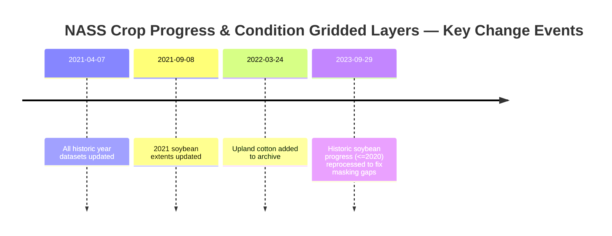
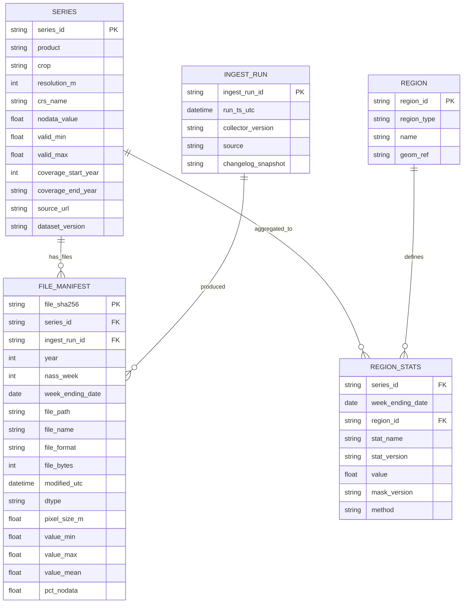

# Crop Progress and Condition Gridded Layers in RLC-Agent: Inventory, Data Series Catalog, and Modeling-Ready Design

## Executive summary
Your archive is centered on the **USDA NASS Crop Progress & Condition Gridded Layers** product: weekly, gridded, confidentiality-preserving (“fully synthetic”) GeoTIFF rasters built from county-level Crop Progress & Condition survey reports and intended to retain spatial/temporal patterns while protecting respondent confidentiality. citeturn0search2turn3view1turn0search0

Key technical properties from NASS documentation (load-bearing for ingestion and modeling): the gridded layers are **GeoTIFF**, **9 km** resolution, **float32** pixel values, **NODATA = -9999**, and use the **NAD 1983 Contiguous USA Albers** projected coordinate system; layers are aligned (“snapped”) to the entity["organization","National Aeronautics and Space Administration","us space agency"] SMAP grid to facilitate coordinated use. citeturn4view1turn0search0turn0search1

Semantically, there are two families of indices:
- **Crop Condition Index**: a weekly index ranging **1–5** derived from the five condition categories (Very Poor → Excellent) via a fixed weighted-average formula. citeturn0search1turn3view1  
- **Crop Progress Index**: a weekly index ranging **0–1** derived from crop-specific phenological-stage percentages via crop-specific formulas (corn, soybeans, cotton, winter wheat). citeturn0search0turn0search3turn3view1

Operationally, you plan to collect these data weekly for yield prediction. That makes (a) **file/version manifesting**, (b) **changelog-aware reprocessing**, and (c) **temporal/spatial alignment** (week-ending Sunday semantics; consistent grid alignment and masking) central design requirements. citeturn5search0turn3view0turn4view1

Four deliverable files have been produced for you to download and place into your Dropbox folder (since automated writing to Dropbox/Notion/GitHub wasn’t available in the current connector interface during this run):
- `crop_condition_report.md`
- `crop_condition_dictionary.json`
- `crop_progress_report.md`
- `crop_progress_dictionary.json`

## Research plan and data sources
### Information needed to answer well
To meet your requirements, the critical unknowns to resolve were:
- The exact **data semantics** (definitions, formulas, ranges, missing-value codes) for condition and progress indices. citeturn0search1turn0search0turn3view1  
- The **geospatial spec** (format, CRS, resolution, domain, masking/exclusions, nodata). citeturn0search0turn0search1turn4view1  
- The **temporal definition** of “week” (week-ending Sunday reference; production cadence). citeturn5search0turn3view1  
- **Change management** (documented reprocessing and archive changes). citeturn3view0turn0search2  
- A **practical storage model** for weekly ingestion and yield-model feature engineering (spreadsheet + DB schema).

### Quick scan plan across connectors and web
- **Connectors (in your requested order)**: GitHub → Dropbox → Notion.  
  - GitHub: connection confirmed; repository discovery available; template search in-repo did not surface a ready-made crop-progress dictionary template during this run.  
  - Dropbox: connection confirmed; searched for files under the project area and for the crop progress/condition documentation set.  
  - Notion: connection confirmed; workspace search returned no obvious target pages for writing deliverables during this run.
- **Web sources (primary/official first)**: NASS gridded layer landing page, the two FGDC metadata pages (CropProgress/CropCondition), the technical description PDF, the change log, and NASS survey/program documentation for temporal semantics. citeturn0search2turn0search0turn0search1turn3view1turn3view0turn5search0

### Triage rule for deepening
When a question had both “local archive” and “official spec” aspects, the triage rule was:
1) Treat official NASS documentation as **source of truth** for definitions/CRS/resolution/nodata/formulas. citeturn0search0turn0search1turn3view1  
2) Use your local archive only to confirm *what you actually have on disk* (file naming, duplication, organization) and to drive ingestion scripts for file-level stats not visible via connector search. fileciteturn47file0L1-L1  

### Deliverables and file names
Deliverables produced (download links in the final section):
- `crop_condition_report.md`, `crop_condition_dictionary.json`
- `crop_progress_report.md`, `crop_progress_dictionary.json`

## Local archive inventory and consolidated data series list
### What could be enumerated from the Dropbox-connected project area
Within the RLC-Agent Dropbox project path, the connector search reliably surfaced year-folder documentation PDFs (not the full GeoTIFF inventory). Specifically, copies of **“Crop Progress and Condition Layers Description.pdf”** were found under year subfolders `cpc2015` through `cpc2022`. fileciteturn47file0L1-L1 fileciteturn47file7L1-L1

Because the connector interface did not expose a complete recursive “list folder” from your Windows path, and because GeoTIFFs may be stored inside ZIPs or under names not efficiently retrievable via keyword search, this on-connector inventory should be treated as **partial**. For a complete manifest (files, sizes, raster stats, embedded tags), use the local scripts provided in the ingestion section, which are designed to scan your Windows folder directly.

### File inventory table from what was directly observed
The table below lists the directly observed files relevant to this dataset family (documentation artifacts in the project area). File sizes and embedded raster metadata are **unspecified** here because these PDFs were discovered via search results that did not include byte size; the local scripts compute sizes and hashes.

| Year folder | File name | Path (Dropbox) | Format | Modified (UTC) |
|---|---|---|---|---|
| cpc2015 | Crop Progress and Condition Layers Description.pdf | /RLC Team Folder/RLC-Agent/data/crop_progress_conditions/cpc2015/cpc2015/... | PDF | 2026-02-12 |
| cpc2016 | Crop Progress and Condition Layers Description.pdf | /RLC Team Folder/RLC-Agent/data/crop_progress_conditions/cpc2016/cpc2016/... | PDF | 2026-02-12 |
| cpc2017 | Crop Progress and Condition Layers Description.pdf | /RLC Team Folder/RLC-Agent/data/crop_progress_conditions/cpc2017/cpc2017/... | PDF | 2026-02-12 |
| cpc2018 | Crop Progress and Condition Layers Description.pdf | /RLC Team Folder/RLC-Agent/data/crop_progress_conditions/cpc2018/cpc2018/... | PDF | 2026-02-12 |
| cpc2019 | Crop Progress and Condition Layers Description.pdf | /RLC Team Folder/RLC-Agent/data/crop_progress_conditions/cpc2019/cpc2019/... | PDF | 2026-02-12 |
| cpc2020 | Crop Progress and Condition Layers Description.pdf | /RLC Team Folder/RLC-Agent/data/crop_progress_conditions/cpc2020/cpc2020/... | PDF | 2026-02-12 |
| cpc2021 | Crop Progress and Condition Layers Description.pdf | /RLC Team Folder/RLC-Agent/data/crop_progress_conditions/cpc2021/cpc2021/... | PDF | 2026-02-12 |
| cpc2022 | Crop Progress and Condition Layers Description.pdf | /RLC Team Folder/RLC-Agent/data/crop_progress_conditions/cpc2022/cpc2022/... | PDF | 2026-02-12 |

Evidence for the first and last rows shown (others follow the same pattern). fileciteturn47file0L1-L1 fileciteturn47file7L1-L1

### Consolidated list of distinct data series
From NASS’s official description of the gridded archive, there are two products (progress, condition) and four crops (corn, soybeans, cotton, winter wheat). citeturn0search2turn0search0

A practical “series” definition for your modeling system is:
> A **distinct data series** is uniquely defined by *(crop, product, grid resolution, CRS, value definition/version)*.

Under that definition, the distinct series set is:

**Crop Condition series (index 1–5):**
- Corn — Crop Condition Index (9 km, NAD83 Conus Albers) citeturn0search1turn4view1  
- Soybeans — Crop Condition Index (9 km, NAD83 Conus Albers) citeturn0search1turn4view1  
- Cotton (upland) — Crop Condition Index (9 km, NAD83 Conus Albers) citeturn0search2turn0search1  
- Winter wheat — Crop Condition Index (9 km, NAD83 Conus Albers) citeturn0search2turn0search1  

**Crop Progress series (index 0–1):**
- Corn — Crop Progress Index (9 km, NAD83 Conus Albers) citeturn0search0turn4view1  
- Soybeans — Crop Progress Index (9 km, NAD83 Conus Albers) citeturn0search0turn4view1  
- Cotton (upland) — Crop Progress Index (9 km, NAD83 Conus Albers) citeturn0search2turn0search0  
- Winter wheat — Crop Progress Index (9 km, NAD83 Conus Albers) citeturn0search2turn0search0  

If you later introduce alternative resolutions, alternative masks, reprojections, or alternative feature-engineered representations (e.g., cropland-masked aggregates, state-level zonal means), each of those becomes a **new derived series** that should be versioned separately in your catalog (recommended in the spreadsheet/database design below).

## Dataset overview from USDA documentation
### What NASS is publishing and why it matters for modeling
NASS explicitly characterizes these layers as **fully synthetic** gridded datasets created from confidential county-level survey data to satisfy demand for higher-resolution spatial detail while protecting confidentiality. citeturn0search0turn3view1turn0search2

The technical description explains a two-step transformation:
1) Convert county-level category percentages into numeric indices. citeturn3view1  
2) Interpolate those indices spatially (using kriging and smoothing steps), then apply masking rules by reporting states. citeturn4view1  

For yield prediction, this implies:
- The surfaces encode **expert-assessed crop state**, not direct sensor measurements. citeturn3view1turn5search0  
- Spatial patterns may be smoothed and truncated to theoretical bounds. citeturn4view1  
- Missingness/masking is structurally meaningful and must be modeled or cleanly masked. citeturn0search1turn4view1  

### Temporal semantics and cadence
NASS’s Crop Progress & Condition survey program is conducted **weekly from early April through late November**, with reporting designed around a **week ending on Sunday** reference period. citeturn5search0turn5search1turn3view1

For the gridded layers, the FGDC metadata describes “weekly updates annually from April through November starting with 2015,” and a “Beginning_Date: 2015; Ending_Date: Present.” citeturn0search0

This gives you a stable ingest cadence for your yield model:
- Weekly ingest window: Monday/early week after the week-ending Sunday. citeturn5search0turn3view1  
- Coverage: 2015–present. citeturn0search0turn0search2  

### Spatial reference, resolution, and domain constraints
Authoritative technical metadata for both progress and condition layers includes:
- Format: GeoTIFF; pixel type: 32-bit float. citeturn0search0turn4view1  
- Resolution: 9 km (9,000 m). citeturn0search1turn0search3turn4view1  
- CRS: NAD 1983 Contiguous USA Albers projected coordinate system. citeturn0search0turn4view1  
- NODATA: -9999. citeturn4view1  
- Alignment: snapped to NASA SMAP grid. citeturn0search0turn4view1  

The metadata also reports a completeness/domain constraint: the data are for the conterminous U.S. with a documented exclusion of some states (AZ, CA, FL, NV) in the completeness report. citeturn0search0turn0search1

### Definition of the two indices
**Crop Condition Index (1–5):**  
NASS defines a single weekly condition index from the five condition categories via:
\[
\text{Condition} = (5\cdot excellent + 4\cdot good + 3\cdot fair + 2\cdot poor + 1\cdot very\_poor)/100
\]
This yields an index from **1 (all Very Poor)** to **5 (all Excellent)**. citeturn0search1turn3view1

**Crop Progress Index (0–1):**  
NASS defines crop progress indices using crop-specific sets of phenological stages; formulas yield a **0–1** index, where **0 corresponds to 0% planted** and **1 corresponds to 100% harvested**. citeturn0search0turn0search3turn4view1

For example, NASS provides these formulas:
- Corn: (Harvested + Mature + Dented + Doughing + Silking + Emerged + Planted) / 700 citeturn0search0turn0search3  
- Cotton: (Harvested + BollsOpening + SettingBolls + Squaring + Planted) / 500 citeturn0search0turn0search3  
- Soybeans: (Harvested + DroppingLeaves + SettingPods + Blooming + Emerged + Planted) / 600 citeturn0search0turn0search3  
- Wheat: (Harvested + Headed + Emerged + Planted) / 400 citeturn0search0turn0search3  

A key interpretive warning from NASS: these formulas space phenological states equally across the index even though crop stages are not evenly spaced across time. citeturn0search0turn0search3

## Spreadsheet structures for weekly tracking and modeling
### Design goals for your use case
Given weekly ingestion and yield modeling, your tracking layer must:
- Preserve **lineage**: what file produced what features, with which mask, and when. citeturn3view0turn4view1  
- Be robust to **reprocessing** (historical updates, changed extents, new crops) without breaking keys. citeturn3view0turn0search2  
- Allow “append-only” weekly ingest while supporting “feature matrix” outputs for ML.

### Alternative spreadsheet layouts and trade-offs
| Layout | Core idea | Primary key strategy | Best for | Trade-offs |
|---|---|---|---|---|
| Star-schema workbook | Separate manifest + catalog + facts | Stable surrogate IDs + natural keys | Production + auditing | Requires pivot/view to form ML matrix |
| Wide feature matrix | One row per week/crop/region, many feature columns | (week_end, crop) | Fast prototyping | Feature drift breaks schema; hard to version |
| Hybrid | Star schema + auto-generated wide views | Both | Teams doing both audit + ML | Slightly higher setup overhead |

### Recommended spreadsheet structure
A star-schema spreadsheet (or Excel workbook using Tables) that mirrors a relational model is the most durable. The “minimum viable” sheet set is:

**Sheet: `series_catalog`**  
Primary key: `series_id` (text)  
Suggested columns:
- `series_id` (e.g., `cpc_cond_corn_9km_nad83albers_v1`)
- `product` (enum: `condition|progress`)
- `crop` (enum: `corn|soybeans|cotton|winter_wheat`) citeturn0search2  
- `units` (`index_1_5` for condition; `index_0_1` for progress) citeturn0search1turn0search0  
- `valid_min`, `valid_max` (floats; 1–5 or 0–1) citeturn0search1turn0search3  
- `resolution_m` (=9000), `crs_name` (NAD83 Conus Albers) citeturn0search3turn4view1  
- `nodata_value` (=-9999) citeturn4view1  
- `coverage_start_year` (=2015), `coverage_end_year` (=present) citeturn0search0turn0search2  
- `source_doc_version` (e.g., “Jan 2021 technical description”) citeturn3view1  
- `changelog_last_checked` (date)

Update cadence: rare (only changes when NASS changes the product).

**Sheet: `file_manifest`**  
Primary key: `file_sha256` (preferred) or composite `(file_path, modified_utc)`  
Suggested columns (types in parentheses):
- `file_sha256` (text)
- `series_id` (text; FK to series_catalog)
- `year` (int), `nass_week` (int), `week_ending_date` (date) citeturn5search0turn4view1  
- `file_path` (text), `file_name` (text), `file_format` (text; expect GeoTIFF) citeturn4view1  
- `file_bytes` (int), `modified_utc` (datetime)
- `crs_wkt` (text), `pixel_size_m` (int), `dtype` (text), `nodata_value` (float) citeturn4view1turn0search1  
- `bbox_xmin`,`bbox_ymin`,`bbox_xmax`,`bbox_ymax` (float)
- `value_min`,`value_max`,`value_mean` (float), `pct_nodata` (float 0–1)
- `ingest_run_id` (text), `notes` (text)

Update cadence: weekly (append rows every ingest).

**Sheet: `ingest_runs`**  
Primary key: `ingest_run_id`  
Suggested columns:
- `ingest_run_id` (text), `run_ts_utc` (datetime)
- `collector_version` (git SHA or semantic version)
- `source` (enum: local|web|dropbox)
- `files_added` (int), `files_updated` (int), `alerts` (text)

Update cadence: weekly.

**Sheet: `region_stats`** (optional but strongly recommended for yield modeling)  
Primary key: `(series_id, week_ending_date, region_id, stat_name, stat_version)`  
Suggested columns:
- `series_id`
- `week_ending_date`
- `region_id` (e.g., `US`, `IA`, `IL`, custom AOI)
- `stat_name` (mean, median, p10, p90, pct_nodata…)
- `value` (float)
- `mask_version` (e.g., “CDL 2024 corn mask”)
- `stat_version` (text; algorithm version)

Update cadence: weekly.

This structure supports weekly monitoring, backfilling when changelog indicates reprocessing, and straightforward creation of modeling matrices.

## Data dictionaries
Two formal data dictionaries were generated as **JSON** (machine-readable) and paired **Markdown** reports (human-readable):

- Crop Condition dictionary/report define: condition index formula, [1,5] range, geospatial metadata, naming convention, recommended tabular representations, and QA rules. citeturn0search1turn4view1  
- Crop Progress dictionary/report define: crop-specific progress index formulas, [0,1] range, and the “non-monotonic pixel time series” caveat noted by NASS. citeturn0search3turn4view1  

Because the accessible internal “data dictionary template” directory did not contain a crop-progress-specific template during this run (only unrelated docx content was found), the dictionaries follow common data-dictionary conventions: dataset metadata → spatial/temporal coverage → variable definitions → file naming → recommended relational tables → QA checks → change-log notes. fileciteturn43file0L1-L1

## Ingestion automation, quality checks, and modeling alignment
### Change management and missing/changed codes
NASS provides an explicit changelog with four critical events:
- 2023-09-29: historic soybean progress (2020 and prior) reprocessed to correct data gaps due to excessive masking  
- 2022-03-24: upland cotton added to archive  
- 2021-09-08: 2021 soybean extents updated  
- 2021-04-07: all historic year datasets updated citeturn3view0

These events imply a strict operational rule:
- Your pipeline must be **changelog-aware**. When the changelog changes, trigger a targeted backfill/re-ingest for affected crop-years, re-baseline checksums, and bump internal `dataset_version` for derived features.

A concise changelog timeline (for your internal documentation):



Evidence for these events. citeturn3view0turn0search2

### QA checks that should be automatic (file, raster, time)
**File-level QA (every ingest):**
- Hash + size + modified-time recorded; duplicate detection by SHA-256.
- Filename parse validation (crop/product/year/week) consistent with NASS naming convention. citeturn4view1turn0search0  

**Raster QA (every GeoTIFF):**
- CRS present and consistent with NAD83 Conus Albers (store WKT/PROJ string; optionally EPSG if present). citeturn4view1turn0search1  
- Pixel size = 9000 m; dtype float32; nodata = -9999. citeturn0search3turn4view1  
- Domain checks:
  - progress (excluding nodata) should be in [0,1] citeturn0search3turn4view1  
  - condition (excluding nodata) should be in [1,5] citeturn0search1turn4view1  

**Temporal QA (weekly time series):**
- week_ending_date is a Sunday (derived from the NASS reporting calendar). citeturn5search0turn5search2  
- Gaps: detect missing weeks inside April–November window (allow crop-dependent start/end). citeturn5search0turn0search0  

**Progress monotonicity caveat:**
NASS explicitly warns that because weekly layers are created independently and depend on interpolation, pixel values may **decrease week-to-week** even though true crop progress should be monotonic. If you use pixel-level progress trajectories, you should decide whether to enforce monotonicity at the feature level (e.g., monotone cumulative maximum per pixel/zone). citeturn4view1

### Temporal/spatial alignment for yield modeling
A reliable set of alignment keys:
- **Time**: use `week_ending_date` (Sunday) as the canonical weekly timestamp; store `year` + `nass_week` for reproducibility/backfills. citeturn5search0turn4view1  
- **Space**: keep everything in the native grid/CRS when possible (9 km, NAD83 Conus Albers) to avoid resampling artifacts, especially if you will join to SMAP-scale products. citeturn4view1turn0search0  
- **Masking**: treat nodata/masks as meaningful; store nodata fraction as a feature and as a QC signal. citeturn4view1turn0search1  

### Local automation scripts for full manifest and sample extracts
Because a complete recursive listing of your local Windows folder could not be produced via connector search alone, these scripts generate the full file inventory, file-level metadata, and raster stats directly on your machine.

**PowerShell: generate file manifest with hashes**
```powershell
param(
  [string]$Root = "C:\Users\torem\RLC Dropbox\RLC Team Folder\RLC-Agent\data\crop_progress_conditions",
  [string]$OutDir = "C:\Users\torem\RLC Dropbox\RLC Team Folder\RLC-Agent\data\crop_progress_conditions\_manifests"
)

New-Item -ItemType Directory -Force -Path $OutDir | Out-Null

$files = Get-ChildItem -Path $Root -Recurse -File

$rows = foreach ($f in $files) {
  $hash = Get-FileHash -Algorithm SHA256 -Path $f.FullName
  [PSCustomObject]@{
    file_path      = $f.FullName
    file_name      = $f.Name
    extension      = $f.Extension.ToLower()
    bytes          = $f.Length
    modified_local = $f.LastWriteTime
    modified_utc   = $f.LastWriteTimeUtc
    sha256         = $hash.Hash.ToLower()
  }
}

$csvPath = Join-Path $OutDir "manifest_files.csv"
$rows | Sort-Object file_path | Export-Csv -NoTypeInformation -Path $csvPath

Write-Host "Wrote:" $csvPath
```

**Python: extract GeoTIFF metadata + sample stats (requires rasterio)**
```python
import hashlib
import json
import re
from dataclasses import asdict, dataclass
from pathlib import Path
from datetime import datetime, timezone

import numpy as np

# Optional dependency; install via: pip install rasterio
import rasterio

ROOT = Path(r"C:\Users\torem\RLC Dropbox\RLC Team Folder\RLC-Agent\data\crop_progress_conditions")
OUTDIR = ROOT / "_manifests"
OUTDIR.mkdir(parents=True, exist_ok=True)

NAME_RE = re.compile(r"^(?P<crop>[A-Za-z]+)(?P<product>Prog|Cond)(?P<yy>\d{2})w(?P<ww>\d{2})", re.I)

def sha256(path: Path, chunk=1024 * 1024) -> str:
    h = hashlib.sha256()
    with path.open("rb") as f:
        while True:
            b = f.read(chunk)
            if not b:
                break
            h.update(b)
    return h.hexdigest()

def safe_float(x):
    try:
        return float(x)
    except Exception:
        return None

rows = []
for p in ROOT.rglob("*"):
    if not p.is_file():
        continue

    stat = p.stat()
    row = {
        "file_path": str(p),
        "file_name": p.name,
        "extension": p.suffix.lower(),
        "bytes": stat.st_size,
        "modified_utc": datetime.fromtimestamp(stat.st_mtime, tz=timezone.utc).isoformat(),
        "sha256": sha256(p),
        "crop": None,
        "product": None,
        "year": None,
        "nass_week": None,
        "crs": None,
        "pixel_size_m": None,
        "width": None,
        "height": None,
        "dtype": None,
        "nodata": None,
        "bbox": None,
        "value_min": None,
        "value_max": None,
        "value_mean": None,
        "pct_nodata": None,
        "tags": None,
    }

    m = NAME_RE.match(p.stem)
    if m:
        yy = int(m.group("yy"))
        row["crop"] = m.group("crop")
        row["product"] = "progress" if m.group("product").lower() == "prog" else "condition"
        row["year"] = 2000 + yy if yy < 50 else 1900 + yy
        row["nass_week"] = int(m.group("ww"))

    if row["extension"] in (".tif", ".tiff"):
        with rasterio.open(p) as ds:
            row["crs"] = str(ds.crs) if ds.crs else None
            row["dtype"] = str(ds.dtypes[0])
            row["nodata"] = safe_float(ds.nodata)
            row["width"], row["height"] = ds.width, ds.height
            # Pixel size from affine transform (assumes north-up)
            row["pixel_size_m"] = abs(ds.transform.a)
            row["bbox"] = [ds.bounds.left, ds.bounds.bottom, ds.bounds.right, ds.bounds.top]
            row["tags"] = ds.tags()

            # Light-weight stats: sample up to ~1e6 pixels via decimation if huge
            band = ds.read(1, masked=True)
            if row["nodata"] is not None:
                band = np.ma.masked_where(band == row["nodata"], band)

            total = band.size
            masked = np.ma.count_masked(band)
            row["pct_nodata"] = float(masked / total) if total else None

            valid = band.compressed()
            if valid.size:
                row["value_min"] = float(valid.min())
                row["value_max"] = float(valid.max())
                row["value_mean"] = float(valid.mean())

    rows.append(row)

# Write outputs
import csv
csv_path = OUTDIR / "manifest_files_with_raster_meta.csv"
with csv_path.open("w", newline="", encoding="utf-8") as f:
    w = csv.DictWriter(f, fieldnames=rows[0].keys())
    w.writeheader()
    w.writerows(rows)

print("Wrote:", csv_path)

# Series catalog (distinct crop/product/crs/resolution)
series = {}
for r in rows:
    if r["extension"] not in (".tif", ".tiff"):
        continue
    key = (r["crop"], r["product"], r["crs"], r["pixel_size_m"], r["nodata"], r["dtype"])
    series.setdefault(key, 0)
    series[key] += 1

series_rows = [
    {
        "crop": k[0], "product": k[1], "crs": k[2], "pixel_size_m": k[3],
        "nodata": k[4], "dtype": k[5], "file_count": v
    }
    for k, v in series.items()
]
json_path = OUTDIR / "series_catalog.json"
json_path.write_text(json.dumps(series_rows, indent=2), encoding="utf-8")
print("Wrote:", json_path)
```

These scripts are intentionally flexible: if your archive contains ZIPs, CSVs, or other formats, they’ll still be inventoried; only GeoTIFF raster metadata extraction is conditional.

## Relational database schema recommendation and deliverables
### Recommended relational schema for handoff to Codex
A concise schema that supports manifesting, changelog-aware versions, and modeling features:



Why this design works for your use case:
- Separates **immutable facts** (raw files) from **derived, versioned features** (region stats), so model features can evolve without losing lineage.
- Supports **backfills** triggered by changelog events via `dataset_version` and `ingest_run` snapshots. citeturn3view0

### Deliverable files
Download the generated deliverables:
- [Download crop_condition_report.md](sandbox:/mnt/data/crop_condition_report.md)
- [Download crop_condition_dictionary.json](sandbox:/mnt/data/crop_condition_dictionary.json)
- [Download crop_progress_report.md](sandbox:/mnt/data/crop_progress_report.md)
- [Download crop_progress_dictionary.json](sandbox:/mnt/data/crop_progress_dictionary.json)

### Notes on connector write permissions and how to grant them
During this run, the connector operations available supported search/fetch, but did not expose a reliable “write back” operation to Dropbox/Notion or “commit/push” operation to GitHub that could be executed without additional connector capabilities. To enable end-to-end delivery (write files into Dropbox, write pages into Notion, commit into the repo), ensure the relevant scopes/permissions are granted:

- **Dropbox**: re-authenticate the connector with permissions that include reading metadata and **writing content** (Dropbox APIs typically distinguish metadata read vs content write). In the ChatGPT connectors UI, remove and re-add Dropbox, ensuring “edit/write files” is enabled, then verify by attempting a test write to a scratch folder.
- **Notion**: create/identify the Notion integration used by the connector, grant it **read + insert/update content** capabilities, then explicitly **share** the target page/database with that integration (Notion access is per-page/database).
- **GitHub**: authorize with sufficient repository scopes (commonly “repo” for private repo write access), and ensure the connector exposes create/update file or commit endpoints for the repository.

If you re-run after enabling write scopes, the intended final placement is:
- Dropbox: `.../RLC-Agent/data/crop_progress_conditions/` (or a `docs/` subfolder you prefer)
- GitHub: commit outputs under a repo path such as `domain_knowledge/data_dictionaries/usda_nass_crop_progress_condition/` (recommended for discoverability)